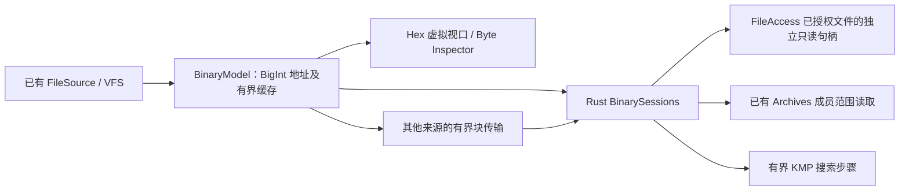

# Elorin Module 18 — Universal Binary & Hex Viewer

中文实施与验收报告，2026-10-08。功能与安全回归通过；四倍 CPU 降速模拟中的滚动约 34 FPS，**未达到稳定 60 FPS**。未进行 2015–2016 年 i5 / 8 GB / Intel HD / 机械硬盘实机验收。不开发 Module 19。

## 1. 实现功能及实施前审计

首先检查实际代码和已有规范，没有发现额外 AGENTS.md。复用 Module 02 的 FileSource、范围限制和 FileAccess 授权句柄，Module 03 的唯一 ViewerRegistry / ViewerController / ViewerShell / ViewerSessionStore，Module 12 的 VirtualFileSource、nativeResource、Archives / SourceLease，以及 Module 17 的格式清单和多视图协议。读取边界由 Rust 继续控制，没有第二套检测或 Viewer 注册体系。

实现只读 Hex，默认每行 16 字节，可切换 8 / 16 / 32。Offset、Hex、ASCII 使用稳定等宽布局；不可打印字节统一为 `·`，字符位置与字节一一对应，尾行不伪造补齐字节。支持鼠标、Shift 范围选择、同步高亮、方向键、Home / End、Ctrl+Home / Ctrl+End、PageUp / PageDown、地址跳转、复制 Hex / ASCII 文本表示 / Offset。复制范围上限 64 KiB，没有任何 Hex 保存或写入命令。

Inspector 使用既有 Inspect 按钮及可隐藏侧面板，提供 UInt8/16/32/64、Int8/16/32/64、Float32/64、ASCII、严格 UTF-8 预览、bits、Hex 和 Decimal。支持大小端；64 位整数使用 BigInt 的精确十进制，NaN / Infinity / -0 明确显示。尾部不足宽度的类型为 Unavailable；UTF-8 非法或预览边界截断明确标识。

Rust 实现 Hex 字节及 UTF-8 字节搜索，支持 next / previous、跨 64 KiB 块、取消、进度和头尾无结果提示。UTF-8 是字节匹配，不进行 Unicode 规范化、正则或源代码执行。浏览器独立模式可查看字节，但没有 Rust，搜索明确显示不可用。

## 2. 新增与修改的文件

新增核心文件：

- [Rust BinaryReadService / Search / Session](D:/Prism/src-tauri/src/binary.rs)
- [BinarySourceAdapter 与有界模型](D:/Prism/src/viewer/plugins/hex/binary-model.ts)
- [HexViewport / Navigation / Inspector](D:/Prism/src/viewer/plugins/hex/HexViewer.tsx)
- [精确字节解释](D:/Prism/src/viewer/plugins/hex/byte-inspector.ts)
- [页面与窗口暂停机制](D:/Prism/src/viewer/plugins/hex/activity.ts)
- [Viewer 插件](D:/Prism/src/viewer/plugins/hex/hex.plugin.tsx)
- [局部样式](D:/Prism/src/viewer/plugins/hex/hex.css)
- [前端契约与生命周期测试](D:/Prism/tests/module-18.test.tsx)
- [模型性能测试](D:/Prism/tests/module-18-performance.test.ts)
- [稀疏样本生成器](D:/Prism/tests/generate-module-18.cjs)
- [桌面与低配模拟测试](D:/Prism/tests/module-18-native-qa.cjs)
- [原生 VFS 与会话隔离测试](D:/Prism/src-tauri/tests/module18_binary.rs)

修改既有入口：

- `D:\Prism\src\services\fileSource.ts`：可选 getSize64 / readRange64，并保留取消绑定。
- `D:\Prism\src\viewer\builtins.ts`、`src\viewer\plugins\binaryFallback.tsx`：惰性 Hex 注册，旧兜底入口复用同一实现。
- `D:\Prism\src\viewer\core\controller.ts`、`types.ts`、`errors.ts`：明确 raw Hex 路由、活动状态及读取错误分类。
- `D:\Prism\src\viewer\components\ViewerHost.tsx`：所有来源的显式 View as Hex 恢复入口。
- `D:\Prism\src\app\App.tsx`、`src\document\DocumentSurface.tsx`：将标签页活动状态传给 Viewer，包括编辑预览来源。
- `D:\Prism\src-tauri\src\lib.rs`、`build.rs`、`capabilities\main.json`：管理会话、命令权限、最小化清理、页面重新加载清理。
- `D:\Prism\src-tauri\permissions\autogenerated\binary_open.toml`、`binary_read.toml`、`binary_close.toml`、`binary_search_start.toml`、`binary_search_step.toml`、`binary_search_cancel.toml`、`binary_stats.toml`：按既有工程规则生成的命令许可。
- `D:\Prism\scripts\generate-formats.cjs`、`src\formats\catalogue.json`、`src\formats\runtime.json`：增加只读 Raw bytes / Hex 视图，更新 unknown 的实际兜底能力。
- `D:\Prism\tests\module-17.test.tsx`、`tests\viewer-host.test.tsx`：验收新的明确 Hex 视图及保留的点击式外部操作。
- `D:\Prism\.gitignore`：排除生成的三个大型稀疏样本。

本段缩写项均以 `D:\Prism\` 为根。没有新增应用或 Rust 依赖；Logo、整体视觉、检测框架和其他模块的解析实现不变。QA 配置为 `D:\Prism\module-18-tauri.local.json`，使用独立 app identifier 和 WebView profile。

## 3. 核心数据流与接口

新增 IPC：binary_open、binary_read、binary_close、binary_search_start、binary_search_step、binary_search_cancel、binary_stats。size、offset、start、cursor、结果地址跨 IPC 均为十进制字符串，Rust 解析为 u64；长度是受限整数。前端全局地址运算为 BigInt，只有已经界定为小范围的行位置、缓存下标及 legacy 安全整数读取才转为 Number。

本地来源仅使用 FileAccess 已授权对象，使用位置读取，避免克隆句柄共享 seek 游标导致多标签串读。native VFS 复用 session / entry；其他 FileSource 以每次最多 64 KiB + 4,095 字节传给 Rust 搜索。没有整文件转入 JS 的通道，也没有新的磁盘副本。原有 compressed VFS 必须已由 Module 12 安全准备；继续受其解压预算和租约限制。

前端块大小 64 KiB；每 Viewer 缓存默认 1 MiB，可在 UI 设为 64 KiB / 256 KiB / 1 MiB / 4 MiB，核心 API 上限 8 MiB。LRU 按实际 Uint8Array byteLength 计费。可见数据最多另保留两个块（128 KiB）；Inspector 最多 16 字节，复制最多 64 KiB。Rust 每会话固定缓存上限 256 KiB；最多 32 会话。预算针对这些字节缓存，不等同于整个 WebView 工作集。

每次搜索步骤最多约 68 KiB，KMP 时间 O(n+m)，模式上限 4,096 字节。IPC byte 数组在反序列化时就限制长度，防止先创建巨大 Vec。取消检查每 4,096 字节发生一次；步骤之间前端合作等待 8 ms，Rust 不自主运行后台扫描。快速跳转最多两个传输读取和一个可替换等待项，过期等待被拒绝，迟到结果不发布。

数据区只渲染可见行及 6 行缓冲；行组件复用不变字节。使用最多 8,192 行的滚动分段以绕过浏览器超长滚动高度限制；Go / Ctrl+Home / Ctrl+End 覆盖完整 u64 范围。横向滚动同步表头。

## 4. 自动化命令与实际结果

| 执行命令 | 实际结果 |
| --- | --- |
| `npm test -- --maxWorkers=2 --reporter=dot` | 35 文件、696 项通过；含 Hex 契约 35 项、模型性能 1 项 |
| `cargo test --manifest-path src-tauri/Cargo.toml` | 75 项通过；包括 12 项 Binary 核心、2 项真实 VFS / 隔离测试及全部既有 Rust 回归 |
| `npm run build` | TypeScript 与 Vite 通过 |
| `npm run tauri -- build --bundles nsis` | 前端、Rust release、NSIS 构建通过，最终产物约 11.93 MiB |
| `node tests/generate-module-18.cjs` | 100 MB / 1 GB / 5 GB 真实稀疏样本生成成功 |
| `node tests/module-18-native-qa.cjs`（设置 PRISM_PLAYWRIGHT） | 32 桌面检查通过、renderer errors=[] |
| `powershell.exe -NoProfile -File tests/module-16-installer-qa.ps1` | 最终 Module 18 安装包的 434 项安装/卸载关联检查通过，UserChoice 保留 |

安装回归摘要：`D:\Prism\docs\qa\module-18-installer-runtime.json`；详细检查沿用 `D:\Prism\docs\qa\module-16-installer-runtime.json`。

既有 PDF、图片、Office、媒体、文本、JSON、CSV、压缩包、科学数据等路由及回归仍执行，没有跳过。旧测试关于 Unsupported UI 的期望按新增 Hex 行为更新，外部操作仍验证仅在点击后执行。完整默认并行测试在与多个构建同时运行时出现一次 Markdown 加载超时；在两个测试 Worker 下完整重跑通过，未放宽断言。初期临时样本过早释放、测试 mock 和 TypeScript 标注错误均已修复，未计作通过结果。

最终构建仍包含既有几何大 chunk 提示及已有动态/静态导入提示；不是新增构建失败。主包约 445.20 kB，Hex 为约 20 kB 的独立惰性 chunk。

## 5. 性能方法、环境与结果

环境：Windows 11 专业版，i7-10750H，6 核 / 12 线程，约 16 GB 可用物理内存；不是目标旧 i5。环境记录：`D:\Prism\docs\qa\module-18-environment.json`。

真实稀疏文件每个仅分配 196,608 字节，逻辑大小分别为 104,857,600 / 1,073,741,824 / 5,368,709,120 字节，含跨块与尾部标记。记录：`D:\Prism\docs\qa\module-18-sparse-fixtures.json`。Rust 101 次范围读取及尾部反向搜索耗时约 18.55 / 17.95 / 16.12 ms；实际缓存始终 ≤256 KiB。记录：`D:\Prism\docs\qa\module-18-rust-performance.json`。

模拟 range provider 的 200 次分散跳转：100 MB / 1 GB / 5 GB 约 111.34 / 106.91 / 185.18 ms。每组总读取 13,107,200 字节，实际缓存峰值均 262,144 字节，不随逻辑文件大小增加。这是模型测试，不冒充真实磁盘计时。记录：`D:\Prism\docs\qa\module-18-model-performance.json`。

真实桌面窗口使用生产前端资源，打开 100 MB / 1 GB / 5 GB 分别约 184 / 184 / 201 ms。四倍 CPU 降速时，40 次跳转平均 474.88 ms、最长 669 ms；60 次滚动帧平均 29.71 ms、最长 42.90 ms，约 34 FPS。首轮开发模式约 361 ms/帧，生产构建与行复用/块预取显著改善，但本模拟仍没有稳定接近 60 FPS。

恢复正常速度后的 30 秒空闲：renderer TaskDuration 0.034042 秒；本次应用与专属 WebView 的 7 个进程合计 CPU 时间增加 0.09375 秒，相当于约 0.31% 的单核时间（未按 12 逻辑核再归一化）。JS heap 约 7 MB，进程工作集合计由约 563 MB 降至 499 MB；这些是整个应用/WebView 的测量，不能等同 Hex 字节缓存。记录：`D:\Prism\docs\qa\module-18-native-runtime.json`，截图：`D:\Prism\docs\qa\module-18-native.png`。

重现方法：生成稀疏样本；构建生产资源；运行 `node node_modules/vite/bin/vite.js preview --host 127.0.0.1 --port 1421`；用上述独立 QA 配置运行 Tauri dev，设置 WEBVIEW2_ADDITIONAL_BROWSER_ARGUMENTS 为 `--remote-debugging-port=9225`、WEBVIEW2_USER_DATA_FOLDER 为 `D:\Prism\.qa-tools\module18-webview`；设置 PRISM_PLAYWRIGHT 为本机既有 Playwright 路径后运行 QA 脚本。脚本使用 CDP CPU rate=4。它不模拟旧 GPU、8 GB 内存压力、机械硬盘或 OS I/O 延迟，因此不能替代目标硬件实测。

## 6. 生命周期与资源释放

借用 FileSource / VFS 租约，不提前 dispose 父来源；只关闭本 Viewer 创建的 Rust session 与缓存。隐藏标签页/页面停止显示行，取消视口读取与搜索并清空前端块缓存。最小化通过页面可见性与窗口事件判断，Rust 同时取消扫描并清空自身缓存；恢复重新读取可见块，无轮询常驻任务。

页面重新加载开始时 Rust 关闭旧 Hex 会话，修复了 QA 发现的 reload 后旧原生句柄残留。普通 Viewer 卸载和 abort 也执行幂等释放；异步 open 在取消后返回时立即关闭新 session。单次操作系统范围读取不能强行抢占，最多完成当前有界块后丢弃结果；不会积压旧扫描循环。

实测最小化时 native cache=0、searches=0；关闭所有文件后 sessions / handles / cache_bytes / searches 全为 0。应用退出后本次 QA 可执行文件与专属 WebView 进程均为 0，见 `D:\Prism\docs\qa\module-18-exit-runtime.json`。Hex 没有创建 Worker 或外部读取守护进程；共享 Tauri 阻塞任务池属于既有运行时。

上述 handle 统计指 Hex 创建的句柄。Module 02 原有、最多 128 个的授权句柄缓存继续由 FileAccess 管理，不能把 Hex 会话归零误报为整个应用所有授权句柄都提前关闭。它们随原缓存淘汰或应用退出释放。

## 7. 安全验证

覆盖负数、非整数、指数、空/超长、超过 u64 的输入、offset+length 溢出、超过文件长度、超过 1 MiB 请求；零字节和极小来源不伪造数据。源码从不执行；Hex 不调用保存、修改或提取文件的命令。

授权缺失被拒绝；读取前后核对本地 revision，使用 pinned object 并检查路径替换，真实删除、截断/变更、替换都有测试。VFS 成员的原有 unsafe/non-file 限制继续执行，已关闭的借用 VFS 租约或 native parent 被拒绝。异常短读、取消、迟到结果、空搜索、超长模式及非法字节值均有检查。Permission denied、读取失败、源变化/关闭、文件不存在与解析失败保留各自错误语义，不能把所有错误重标为 unknown format。

OS ACL、真实损坏存储设备和不可抢占的长时间内核 I/O 没有实机故障注入；授权拒绝及边界/变更/删除/短读路径已自动化验证。

## 8. Module 17 与专用 Viewer 的集成

保留 `core.binary-fallback` ID 与既有优先级，实际实现替换为同一 Hex 插件；新增 `hex` ID 只用于显式路由。PDF/图片/Office/音视频等正常专用 Viewer 优先级及解析过程不变。所有格式清单增加 Raw bytes / Hex 视图；unknown 的兜底能力更新为真实只读字节查看。既有 137 项系统关联策略不增加 Hex 文件类型或新自动关联。

手动 View as Hex 直接使用原 FileSource，绕过可能已失败的格式投影；不修改原 descriptor、检测证据或源字节。专用解析失败仍显示原错误并保留这个手动入口，读取授权失败仍在相同 Rust 边界拒绝。Hex 界面没有编辑器；既有文本编辑模块属于用户明确切回文本编辑的另一种操作。

## 9. 已知限制与交付

- 四倍 CPU 模拟仅约 34 FPS，未达到稳定 60 FPS；旧 i5/8 GB/Intel HD/机械硬盘尚未实测，这是未完成的性能验收项。
- 浏览器独立模式没有 Rust 搜索；桌面模式可对本地和其他范围来源进行 Rust 分块搜索。
- legacy FileSource 只能在 Number 安全范围内精确读取；超过该范围需要可选 readRange64 / getSize64 或 native locator，明确报错，不整文件复制。
- 整个文件的滚动条采用分段显示，完整地址使用 Go 和键盘跳转；不是按巨大文件大小建立 CSS 超高画布。
- UTF-8 Inspector 是最多 16 字节的严格预览，边界上未完成的字符标为 incomplete。复制文本采用屏幕 ASCII 一字节一位置表示。
- 操作系统单次阻塞 I/O 无强制抢占；取消是有界操作间的合作取消及迟到丢弃。

正式产物：[Elorin 安装包](D:/Prism/src-tauri/target/release/bundle/nsis/Elorin_0.1.0_x64-setup.exe)、[release 可执行文件](D:/Prism/src-tauri/target/release/prism.exe)。范围止于 Module 18。
