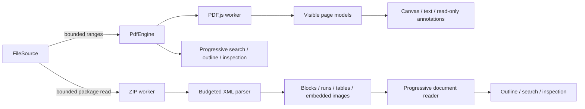

# Module 09 — PDF and Office document viewers

## Routing and ownership

The generic viewer registry lazily resolves `pdf` and `office-document`. Browser and Rust detection recognize PDF, DOCX package parts, ODT's stored MIME entry, RTF magic and the OLE WordDocument stream. XLSX remains a separate type. No document extension switch was added to App or ViewerHost.

`ViewerContext.onCleanup` owns worker and object URL cleanup. `PdfEngine` isolates PDF.js loading, authentication, permissions, range delivery, text streaming, rendering and metadata. React owns reading position, zoom, rotation and panels. UI code does not import PDF.js directly.

## PDF behavior

- Continuous and single-page modes; page number, previous/next, fit width/page, 25–800% custom zoom and view rotation.
- One scrollable page surface. Only intersecting pages plus nearby pages mount. Far canvases are cleared and PDF page resources are cleaned when their components leave the window.
- A separate virtual thumbnail scroll surface and an eight-entry ImageBitmap LRU. Closing the document closes every cached bitmap.
- PDF.js renders glyphs to canvas and a real TextLayer provides selectable text. Search uses bounded streaming text extraction, a 24-page text LRU, literal/case/whole-word matching, progressive results and generation cancellation. Selected text fragments are highlighted without replacing the canvas text.
- Chinese and Japanese adjacent text fragments remain contiguous in the search index. Scan-only pages explicitly state that text/OCR is unavailable.
- Embedded outlines use actual PDF destinations. Link buttons call safe explicit URL actions or resolve internal destinations. Notes can be read. Widget appearances remain static; no editable form controls are created.
- Password input is cleared after submission and never written into session metadata. Copy restrictions disable text extraction and search. Printing is not exposed.
- Inspection exposes document metadata, encryption, pages, current page dimensions/rotation, text item counts and supported image drawing-operation counts. Embedded attachments are listed from PDF.js metadata; attachment contents are never requested.

### PDF budgets

| Resource | Limit / strategy |
| --- | --- |
| Initial range | 256 KiB |
| FileSource call | At most 1 MiB |
| Single engine range request | 32 MiB |
| Decoded canvas | 8 million pixels per mounted canvas, DPR at most 2 |
| PDF image | 32 million source pixels |
| Page count | 20,000 |
| Text | 250,000 characters and 50,000 items per page; streaming cancellation at the limit |
| Text LRU | 24 pages |
| Thumbnail LRU | 8 bitmaps |
| Search | 10,000 results |
| Outline | 2,000 entries, depth 20 |

The range adapter never calls `readAll`. Streaming and automatic prefetch are disabled. CMaps, standard fonts, WASM and worker code are bundled locally. Metadata is fetched after the first page has been acquired, rather than blocking on every page's text or thumbnails.

PDF.js retains encoded ranges it has requested internally. The adapter does not promise a constant total worker heap after visiting every page of an image-heavy document. Canvas/text/thumbnail ownership is bounded; decoded images and page resources are released through page cleanup. The tested 1001-page layout is within browser scroll-height limits; 20,000 pages at extreme zoom can exceed a browser's physical scroll-height limit and have not been verified.

## Office behavior

The package worker validates the central directory before incremental inflation. Entry names are treated only as package keys and are never written to disk. CRC, declared/actual sizes, compression methods, encryption flags, entry count, expansion ratio and aggregate budgets are checked.

XML is parsed into a restricted document model; no arbitrary HTML is inserted. DOMParser runs on the main thread after size/depth/node preflight. The ZIP work is off-thread. Large document bodies initially render 100 sections and append near the scroll boundary; searching can materialize a later section. This is progressive flow rendering, not complete Office pagination or full DOM virtualization.

DOCX supports paragraph and heading styles, bold/italic/underline, safe font names, bounded font size, colour, alignment, basic numbering, tables, horizontal cell spans, page-break indicators, bookmarks, hyperlinks and embedded images. Content controls are traversed. Insertions are visible, deletions are omitted with a preview note. Footnotes/endnotes are appended; comments are counted. Charts, equations, SmartArt, OLE and unsupported images use placeholders or preview notes. Vertical table merges currently use a simplified layout with an explicit note.

ODT supports text/headings, inline formatting, lists, simple tables, embedded pictures, bookmarks and links. Advanced repeated/merged table structures and tracked-change reconstruction are not a full OpenDocument implementation. RTF supports Unicode controls, escaped text, paragraphs, basic formatting, colours/fonts/alignment and simple table rows; advanced fields and embedded pictures/objects may use a placeholder. Legacy DOC uses an explicit limited-support fallback with desktop Open With and the shared File Inspector.

### Office budgets

| Resource | Limit |
| --- | --- |
| Compressed file | 64 MiB |
| Entries | 2,048 |
| Expanded aggregate | 128 MiB |
| Expanded entry | 32 MiB |
| XML / RTF | 8 MiB |
| XML nodes / depth | 100,000 / 64 |
| Reading sections | 20,000 |
| Embedded image bytes | 32 MiB aggregate, 8 MiB per image |
| Image URLs | 64 unique images |
| Raster dimensions | 32 million pixels, dimensions at most 32,768 |
| Search | 10,000 occurrences |

Office image previews reuse Module 08's header parsing and SVG sanitizer. Blob URLs are registered immediately, reused per package part and revoked on unload or a later parse failure. External images/fonts/relationships are not fetched automatically. Reader links share the Markdown URL classifier and file-service boundary.

## Security and lifecycle

PDF JavaScript and Launch actions have no execution path: no scripting manager, document sandbox, launch service or arbitrary action executor is instantiated. XFA is disabled. Attachment metadata is shown without extraction. Tauri's CSP permits local PDF fonts/workers/WASM, but no arbitrary JavaScript eval or external document connections.

Office rejects DTD/entity declarations, hostile paths, ZIP expansion abuse and XML nesting/node budgets. Styles are primitives assigned to React properties. Fonts cannot contain CSS expressions/URLs. SVG uses the existing sanitizer. Remote content never renders automatically. External navigation requires a click and permits only safe HTTP(S) URLs; desktop related files remain subject to existing file grants and path confinement.

PDF loading tasks destroy their workers on unload or load failure. Render jobs cancel on zoom/page changes, canvases are zeroed, TextLayers cancel, page cleanup runs and bitmaps close. Office worker completion/failure terminates the worker; resource release wrappers are idempotent and also run when a later XML part fails. Password prompts, unfinished searches and late rendering cannot retain an old visible file model.

## Dependencies and source references

- PDF.js `pdfjs-dist` 6.4.299, Apache-2.0. Used as an isolated lazy engine and worker, not an iframe or built-in browser PDF viewer. The installed v6 API uses Set permissions and Map attachment metadata. [PDF.js API](https://mozilla.github.io/pdf.js/api/draft/module-pdfjsLib.html).
- `fflate` 0.8.3, MIT. Supplies incremental raw inflation and fixture ZIP writing. Package validation and budgets are implemented in Prism. [fflate source and streaming API](https://github.com/101arrowz/fflate).
- Existing Module 08 image parsing/SVG sanitizer and shared Markdown URL classifier are reused. No Office application, cloud converter, OCR service or remote font service is required.

PDF.js core is isolated into a lazy `pdf-core` chunk, UI/adapter into the PDF plugin chunk, and the PDF worker into an asset. Office has a separate lazy plugin and small package worker. The 199 local PDF resource files total 3,519,456 bytes; licenses are included. The complete resource inventory is in `module-09-assets.json`.
